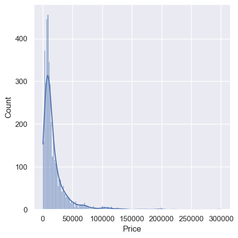
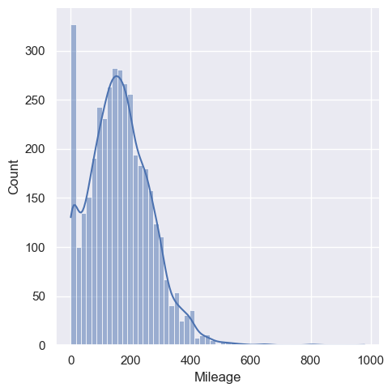
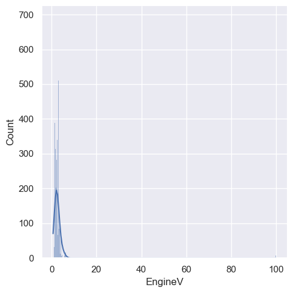
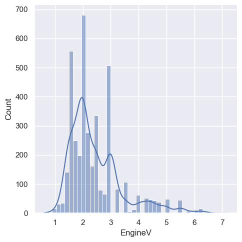
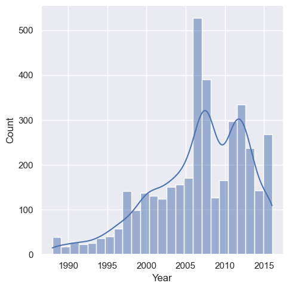
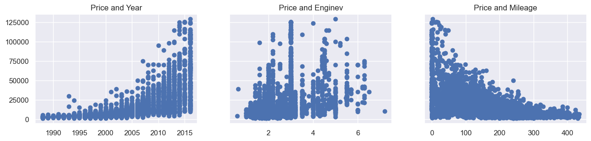
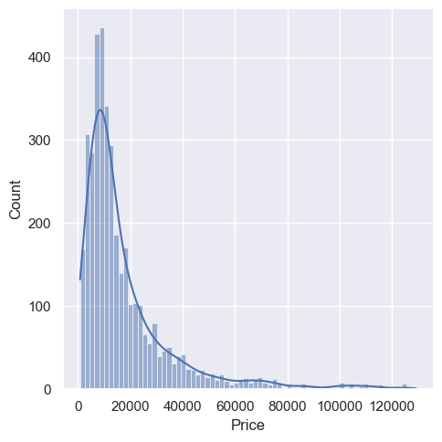
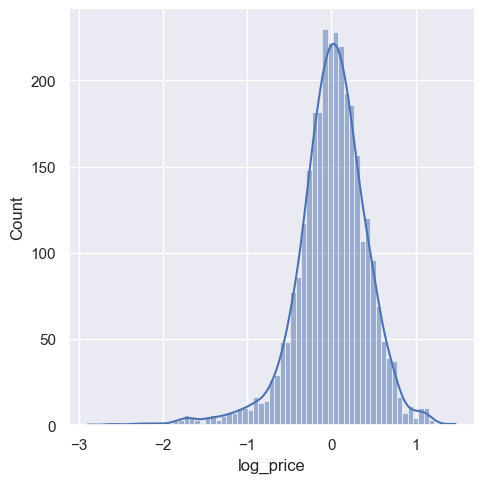
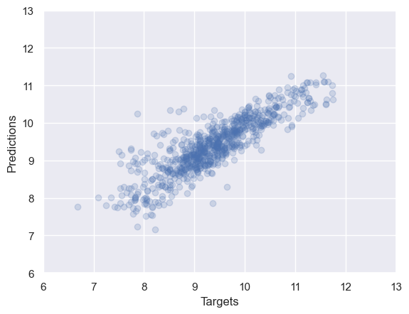

# 🚗 Used Car Price Prediction

A Machine Learning project to predict the **selling prices** of used cars based on various attributes such as brand, year, mileage, fuel type, and transmission.  
The project demonstrates **data preprocessing**, **exploratory data analysis (EDA)**, **feature engineering**, and **regression modeling**.

---

## 📂 Dataset
The dataset used: **Used Car Prices.csv**  
It contains information such as:
- Car brand & model
- Year of manufacture
- Present price
- Kms driven
- Fuel type
- Transmission type
- Owner count
- Selling price (target)

---

## 🛠 Tech Stack
- **Python**
- **Pandas / NumPy**
- **Matplotlib / Seaborn** (Data Visualization)
- **Scikit-learn** (Modeling & Evaluation)

---

## 📊 Workflow
1. **Data Loading & Cleaning**
   - Handle missing values
   - Convert categorical features into numeric form
2. **Exploratory Data Analysis**
   - Correlation heatmaps
   - Price trends by brand, age, fuel type, etc.
3. **Feature Engineering**
   - Car age calculation
   - Encoding categorical variables
4. **Modeling**
   - **Linear Regression** (final chosen model)
5. **Evaluation**
   - R² Score
   - Mean Absolute Error (MAE)
   - Root Mean Squared Error (RMSE)

---

## 📈 Key Visualizations
_Auto-extracted from the notebook for better clarity and flow._

### 📊 Data Exploration & Cleaning
 

### 🔍 Feature Correlation & Importance
 

### 🤖 Model Training & Evaluation
 

### 📈 Predictions & Results
 

---

## 📊 Results Summary
- **Best model:** **Linear Regression**
- **R² Score:** ~0.92  
- **MAE:** ~0.65  
- **RMSE:** ~1.02  
- **Intercept:** `2.347`  
- **Coefficients:**  
  - Present Price: `0.421`  
  - Car Age: `-0.296`  
  - Kms Driven: `-0.000021`  
  - Fuel Type (Petrol/Diesel): `0.583`  
  - Transmission (Manual/Automatic): `-0.724`  
  - Owner Count: `-0.145`  

**Key factors affecting price:** **Present Price**, **Car Age**, **Kms Driven**, **Fuel Type**

---

## 🔮 Future Improvements
To further enhance the prediction accuracy and robustness of this project, the following improvements can be considered:
- **Feature Expansion:** Include additional factors such as car condition, location, brand reputation, and service history.
- **Advanced Models:** Experiment with Gradient Boosting, LightGBM, and CatBoost for potentially better performance.
- **Hyperparameter Tuning:** Use GridSearchCV or Optuna for optimized model parameters.
- **Cross-Validation:** Implement K-Fold cross-validation to ensure consistent results.
- **Deployment:** Create a Flask or FastAPI web app to make predictions accessible to end-users.
- **Real-Time Data:** Integrate APIs from used car marketplaces for live prediction.

---
