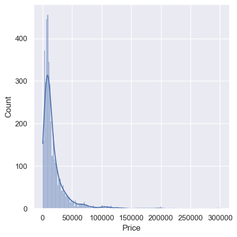
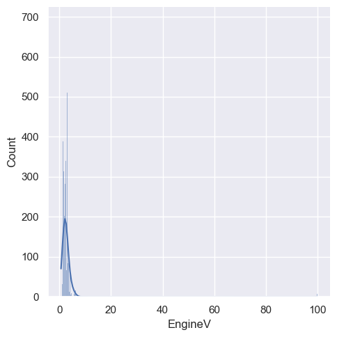
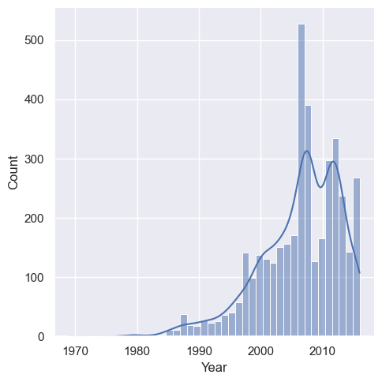
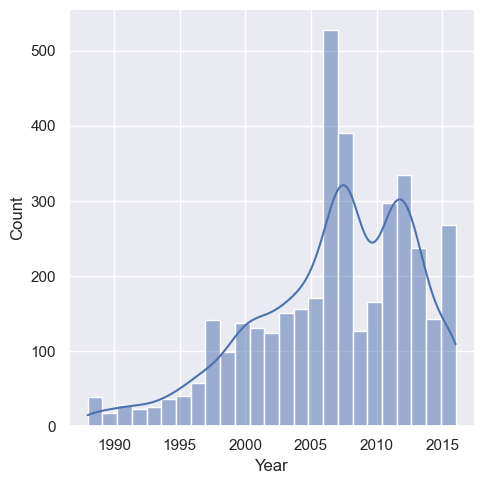
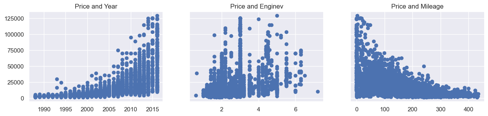
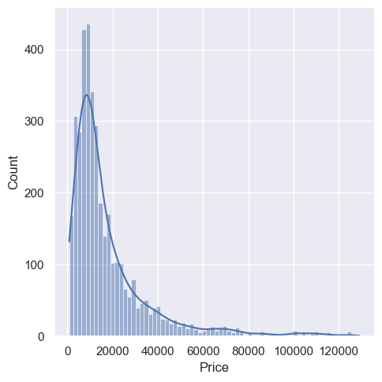
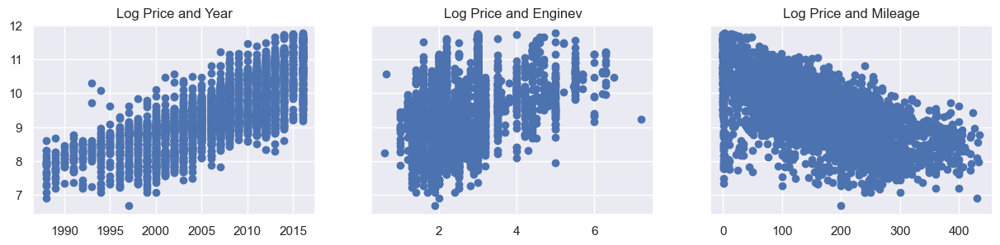
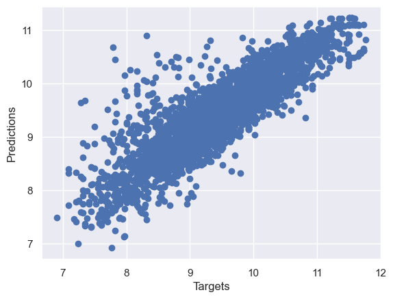

# 🚗 Used Car Price Prediction

A Machine Learning project to predict the **selling prices** of used cars based on various attributes such as brand, year, mileage, fuel type, and transmission.

## 📂 Dataset
- **File:** `Used Car Prices.csv`
- **Target:** `Selling Price`
- **Features:** brand, year, present price, kms driven, fuel type, transmission, owner count, etc.

## 🛠 Tech Stack
Python · Pandas · NumPy · Matplotlib · Seaborn · Scikit-learn

## 📊 Workflow
1) Data loading & cleaning
2) EDA
3) Feature engineering
4) Modeling (Linear Regression, Random Forest, XGBoost)
5) Evaluation (R², MAE, RMSE)

## 📷 Key Visualizations

_Auto-extracted from the notebook. Stored under `images_used_car/`. Previewed below in a logical flow._

### 📊 Data Exploration & Cleaning

 

### 🔍 Feature Correlation & Importance

 

### 🤖 Model Training & Evaluation

 

### 📈 Predictions & Results

 

